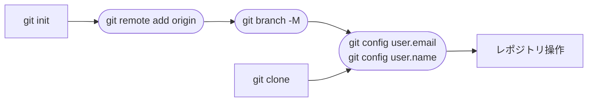

# レポジトリの登録



## レポジトリの新規作成

レポジトリを新規にローカルフォルダで作成したものをアップロードする場合、アップロードしたいフォルダに入り、以下のコマンドで初期化します。

```
git init
```

次にリポジトリのURLを以下のコマンドで登録します。

```
git remote add <リポジトリのURL>
```

もしアップロールするブランチを `master` 以外のものにしたい場合、以下のコマンドで該当するブランチ名を登録します。 

```
git branch -M <ブランチ名>
```

## 既存のレポジトリをクローン（ダウンロード）

既存のレポジトリをローカル環境にダウンロードしたい場合は、配置したいフォルダに移動して、以下のコマンドを使ってクローンを行います。

```
git clone <レポジトリのURL>
```

クローンを行うと、リポジトリ操作に必要な各種設定は文字通りクローンされてきますので、`git init` とその他初期設定の必要はありません。

>[!NOTE]
>もしデフォルトで指定されているブランチ以外にアップロードしたい場合などは、上記でブランチを指定したのと同じコマンドを通じて変更します。もちろんそれ以外の設定項目も自由に変更することができますが、独自の設定は各プロジェクトのレギュレーションに則って行ってください。

## ユーザー情報の登録

最後に、必要なユーザー情報を以下のコマンドで登録します。

```
git config --global user.name "Your Name"
git config user.email "xxxxxxxx@example.com"
```

これでひとまずレポジトリ操作を行う準備が完了したので、[次のステップ](https://github.com/DERaC-Global/tag_japan/tree/main/docs/github/INITIAL_COMMIT.md)に進みます。
