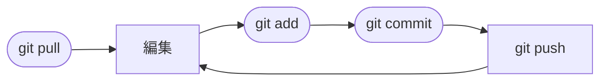

# 初めてのPUSHとその後のルーティーン



Github でのレポジトリの操作は、**編集**した**変更を追加**（add）して**確定**（commit）したものを**アップロード**（push）することになります。また、リポジトリがほかのメンバーによって**編集されている可能性**がある場合は、そのファイルを**同期**（pull）させてから**アップロード**します。それぞれのアクションについての詳細は以下の通りです。

>[!NOTE]
>これら一連の流れの中で、**確定**・**アップロード**・**同期**のことを Github の用語で、コマンドと対応して、それぞれ**コミット** (commit)・**プッシュ** (push)・**プル** (pull)と呼んでいます。また、Github におけるすべての **CRUD 操作**は *Commitment*（コミットメント）という操作で行われます。このため、コミットメントを行うと毎回コメントの記入を求められます。頻度が多いので、あまり深く考えず、一言コメントを入力してください。

## git add

ファイルを編集したり、フォルダを追加したりした後にリポジトリにプッシュするための最初の手続きとして、対象となるファイル・フォルダを指定し、コミット対象ファイルとして追加します。

>[!WARNING]
>これ以降の操作は、`.git` フォルダが置いてあるディレクトリに移動して行う必要があります。`.git` は `git init` を実行したディレクトリ（`git clone` で導入した場合はそのファイル群の最上位階層）になります。

```
git add <追加するファイル・フォルダ>
```

すべて追加する場合は以下のように `.` を指定します。

```
git add .
```

また、`example` フォルダ内の Python ファイル（拡張子が `.py`）のみを追加したい場合、ワイルドカード `*` を使って以下のようなコマンドを使うことができます。

```
git add example/*.py
```

## git commit

`git add` で追加されたファイル・フォルダをプッシュする前にコミットを行います。このとき、それぞれのコミットに対するコメントを追加してください。

```
git commit -m "コメント"
```

## git push

コミットしたファイル・フォルダをリポジトリにプッシュします。ここで `master` 以外のブランチを指定する場合は事前に `git branch -M` で指定しておく必要があります。

```
git push origin <ブランチ名>
```

例えば、ブランチの指定を行っていない場合、以下のような `master` に対するプッシュ以外だとエラーになります。

```
git push origin master
```

もし、`main` というブランチ（リポジトリに作成されている必要がある）にプッシュしたい場合、以下のような流れになります。

```
git branch -M main << 一度設定すればそれ以降必要なし
git pusg origin main
```

>[!NOTE]
>`git branch -M` はブランチが複数ある場合に一度設定したブランチを変更する際にも使えます。

## git pull

リポジトリでチーム作業を行っている場合、編集中にほかのメンバーが先にプッシュしている可能性があります。この可能性がある場合は、事前にプルで同期をしてからプッシュしてください。

```
git pull
```

>[!NOTE]
>同じファイルでコンフリクトが起きた場合はプッシュした後に差分を表示させることができます。